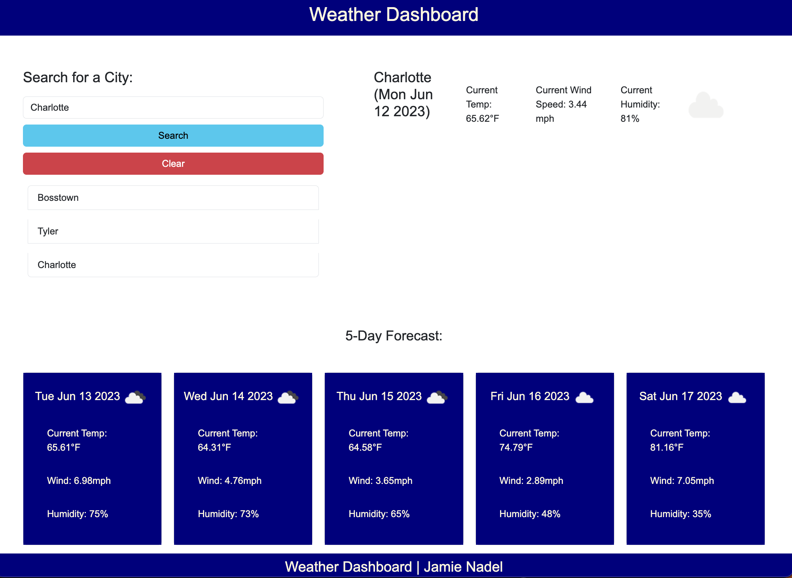

# weather-dashboard

## Description
A weather application that can display current weather and a 5 day forecast for a city chosen by the user.   The application uses the OpenWeather API to retrieve weather data for cities.  The application uses `localStorage` to store any persistent data.

## Usage
Open [url](https://bnadel4.github.io/weather-dashboard/) in web browser. 
Type a city name in the input form and click the search button to display weather information. 

## Credits

[OpenWeather](https://openweathermap.org/)

## License

MIT License 
